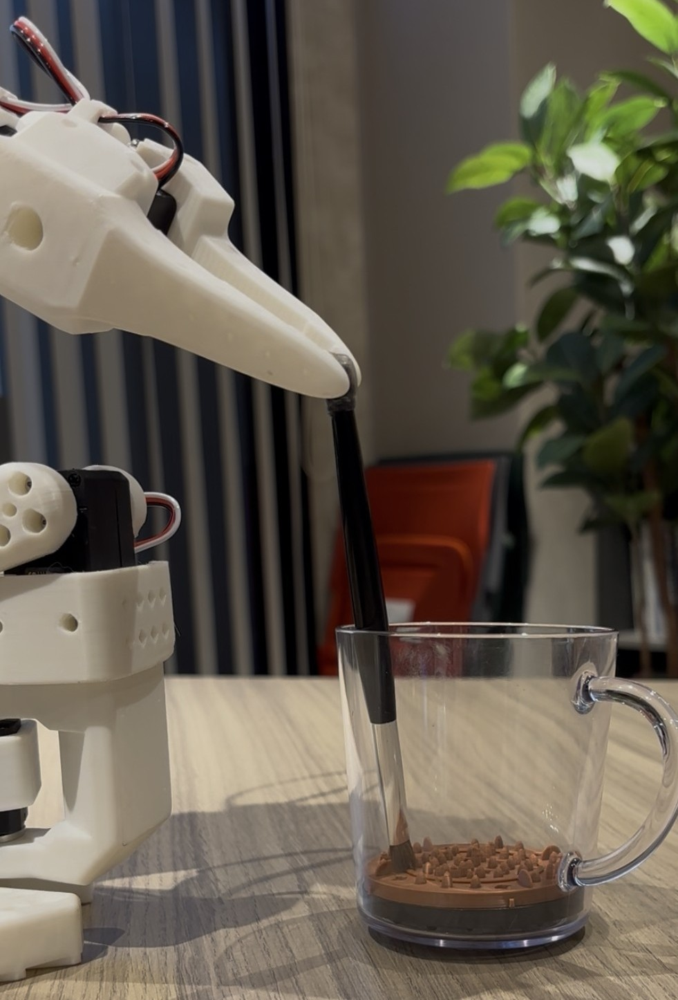
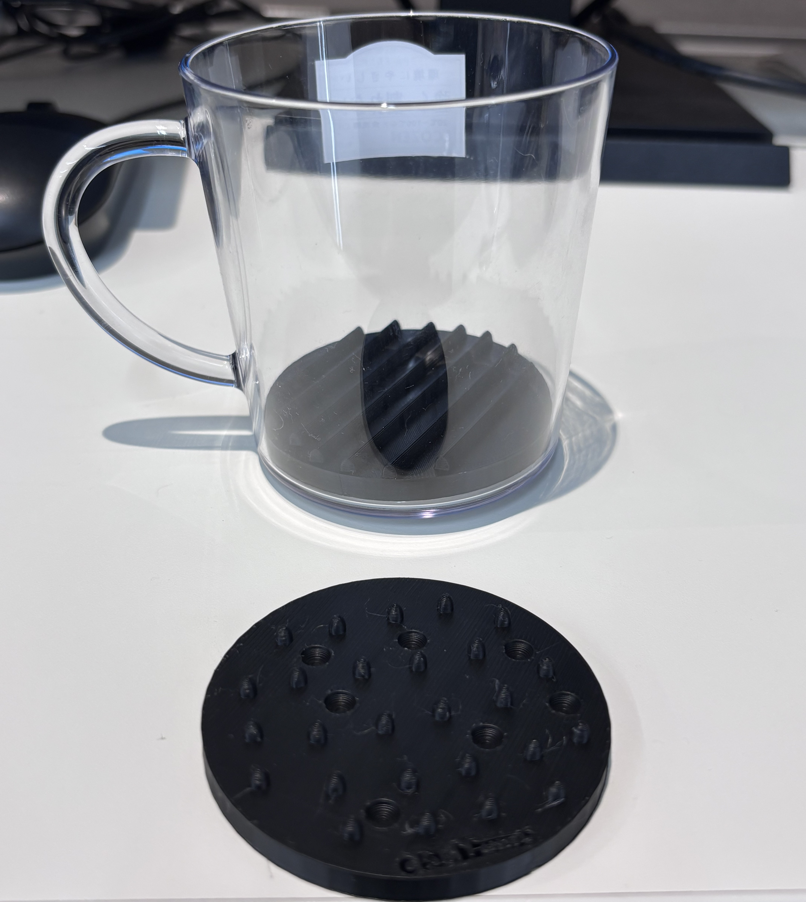
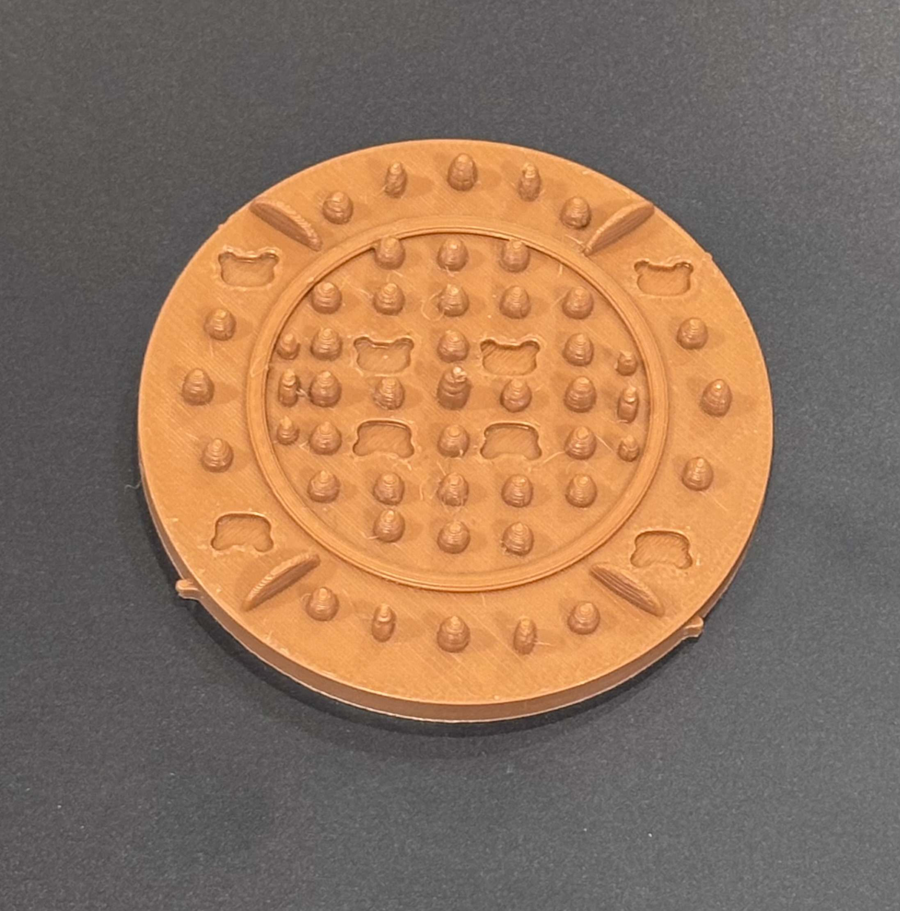

# 📁 photoフォルダ 使い方ガイド 🐻

このガイドでは、`photo`フォルダの使い方と、画像・PDFファイルの管理方法を説明します。

---

## 🎯 photoフォルダとは？

ポートフォリオで使用するすべての画像とPDFファイルを保存するフォルダです。

**メリット：**
- ✅ ファイルが整理される
- ✅ HTMLファイルと画像ファイルが混ざらない
- ✅ 管理しやすい
- ✅ 後から画像を探しやすい

---

## 📂 フォルダ構成

```
portfolio/
├── index.html                      # トップページ
├── robot.html                      # ロボットプロジェクト
├── ux-design.html                  # UXデザイン
├── beauty-sns.html                 # 美容垢SNS運用
├── pege1.html                      # データベースプロジェクト
├── photo/                          # 📁 このフォルダ！
│   ├── photo1.jpg                  # About Me写真1
│   ├── photo2.jpg                  # About Me写真2
│   ├── robot-main.jpg              # ロボットメイン写真
│   ├── plate-before.jpg            # 初期プレート
│   ├── plate-after.jpg             # 改良プレート
│   ├── bear-cad.jpg                # CADのクマ
│   ├── demo.jpg                    # デモ写真
│   └── robot-presentation.pdf      # プレゼン資料
├── README.md
├── CHANGELOG.md
└── PROJECT-EDIT-GUIDE.md
```

---

## 🖼️ ファイル一覧

### About Me用（2枚）
- **photo1.jpg** - 自己紹介セクションの写真1
- **photo2.jpg** - 自己紹介セクションの写真2
  - 推奨サイズ: 800x800px（正方形）

### ロボットプロジェクト用（5枚 + PDF）
- **robot-main.jpg** - ロボット全体の写真
  - 推奨サイズ: 1200x800px
- **plate-before.jpg** - 初期の3Dプリントプレート
  - 推奨サイズ: 800x800px
- **plate-after.jpg** - 改良後のプレート
  - 推奨サイズ: 800x800px
- **bear-cad.jpg** - CADで作ったクマ
  - 推奨サイズ: 800x800px
- **demo.jpg** - デモ写真
  - 推奨サイズ: 1200x800px
- **robot-presentation.pdf** - プレゼン資料

---

## 📝 画像の追加方法

### ステップ1: photoフォルダを作成（初回のみ）

**ローカル環境:**
```
ポートフォリオフォルダ内に「photo」という名前のフォルダを作成
```

**GitHub:**
1. GitHubリポジトリを開く
2. 「Add file」→「Create new file」
3. ファイル名に `photo/.gitkeep` と入力
4. 「Commit new file」

### ステップ2: 画像を準備

1. **画像を編集**
   - サイズ調整（800x800px または 1200x800px）
   - ファイル形式: JPG または PNG
   - ファイルサイズ: 2MB以下推奨

2. **ファイル名を変更**
   - 半角英数字のみ
   - スペースは使わない
   - 小文字推奨

**良い例：**
- `photo1.jpg` ✅
- `robot-main.jpg` ✅
- `my-project-image.jpg` ✅

**悪い例：**
- `写真1.jpg` ❌（日本語）
- `Photo 1.jpg` ❌（スペース）
- `PHOTO1.JPG` ❌（大文字）

### ステップ3: photoフォルダに配置

**ローカル環境:**
```
画像ファイルを photo/ フォルダにドラッグ&ドロップ
```

**GitHub:**
1. リポジトリの `photo` フォルダを開く
2. 「Add file」→「Upload files」
3. 画像ファイルをドラッグ&ドロップ
4. 「Commit changes」

### ステップ4: HTMLファイルで参照

HTMLファイルでは、`photo/` から始まるパスで画像を指定：

```html
<!-- 正しい書き方 -->



<!-- 間違った書き方 -->
 ❌
 ❌
```

---

## 🔧 HTMLでの画像パス

### index.html（About Me写真）

```html
<!-- About Meセクション -->


```

### robot.html（ロボットプロジェクト）

```html
<!-- メイン写真 -->


<!-- プレート写真 -->



<!-- クマのデザイン -->


<!-- デモ写真 -->


<!-- PDF -->
<embed src="photo/robot-presentation.pdf" type="application/pdf">
```

---

## ✏️ 画像の変更・更新方法

### 画像を差し替える

1. **古い画像を削除**（または上書き）
2. **新しい画像を追加**（同じファイル名で）
3. **ブラウザで確認**

**注意：** 
- ファイル名が同じなら、HTMLを変更する必要なし
- ファイル名を変更した場合は、HTMLも更新

### 画像を追加する

1. **photoフォルダに新しい画像を追加**
2. **HTMLファイルを編集**
   ```html
   
   ```
3. **保存して確認**

---

## 🗑️ 画像の削除方法

### ローカル環境

1. `photo` フォルダを開く
2. 削除したい画像を選択
3. Delete キーで削除

### GitHub

1. リポジトリの `photo` フォルダを開く
2. 削除したい画像をクリック
3. 右上のゴミ箱アイコン
4. 「Commit changes」

**⚠️ 注意：**
- 削除した画像を使っているHTMLがあれば、画像が表示されなくなります
- 削除前に、どのHTMLで使われているか確認しましょう

---

## 💡 よくある質問

### Q1: photoフォルダがないとどうなりますか？

**A:** 画像が表示されません。

HTMLが `photo/photo1.jpg` を探すのに、`photo` フォルダがないとエラーになります。

### Q2: photoフォルダ内にさらにフォルダを作れますか？

**A:** 作れますが、おすすめしません。

例：
```
photo/
├── about/
│   ├── photo1.jpg
│   └── photo2.jpg
└── robot/
    └── robot-main.jpg
```

この場合、HTMLのパスも変わります：
```html


```

**シンプルに `photo/` 直下に全部入れる方が管理しやすいです。**

### Q3: 画像が表示されません

**A:** 以下を確認：

1. **ファイル名が正しいか**
   - 大文字・小文字を確認
   - スペースが入っていないか
   - 拡張子（.jpg）は正しいか

2. **photoフォルダに画像があるか**
   - ファイルの場所を確認

3. **HTMLのパスが正しいか**
   ```html
   <!-- 正しい -->
   
   
   <!-- 間違い -->
   
   
   
   ```

4. **ブラウザのキャッシュをクリア**
   - Ctrl + F5（Windows）
   - Cmd + Shift + R（Mac）

### Q4: PDFもphotoフォルダに入れるんですか？

**A:** はい！

画像だけでなく、PDFファイルも `photo` フォルダに入れます。

例：
```
photo/
├── robot-presentation.pdf
└── portfolio-overview.pdf
```

### Q5: ファイル名は日本語でもいいですか？

**A:** 使えますが、おすすめしません。

日本語ファイル名は：
- ❌ 文字化けする可能性
- ❌ 一部のブラウザで表示されない
- ❌ GitHubでエラーになる可能性

**半角英数字を使いましょう：**
- ✅ `photo1.jpg`
- ✅ `robot-main.jpg`
- ✅ `my-project.jpg`

---

## 📚 参考：画像の最適化

### 推奨サイズ

**正方形（About Me、プロジェクト画像）:**
- サイズ: 800x800px
- ファイルサイズ: 500KB以下

**横長（メイン写真、デモ写真）:**
- サイズ: 1200x800px
- ファイルサイズ: 1MB以下

### 画像圧縮ツール

**オンラインツール:**
- [TinyPNG](https://tinypng.com/) - 無料、簡単
- [Squoosh](https://squoosh.app/) - Google製
- [iLoveIMG](https://www.iloveimg.com/ja) - リサイズも可能

**使い方:**
1. 画像をアップロード
2. 圧縮
3. ダウンロード
4. photoフォルダに配置

---

## 🎯 まとめ

**photoフォルダの使い方:**
1. `photo` フォルダを作る
2. 画像・PDFファイルを入れる
3. HTMLで `photo/ファイル名` と書く
4. 完成！

**ルール:**
- ✅ ファイル名は半角英数字
- ✅ スペースは使わない
- ✅ 小文字推奨
- ✅ 画像サイズは2MB以下

**困ったら:**
1. ファイル名を確認
2. photoフォルダに画像があるか確認
3. HTMLのパスを確認
4. ブラウザをリロード

---

**作成日:** 2026年2月13日
**対象:** ポートフォリオサイト
